# Ecommerce-Sales-Analysis-Dashboard

---

## Introduction
This is a PowerBI project on an Ecommerce Sales analysis of a fictitious US Based company called **NxEdge Stores** which specialises in Technology, Furniture and Office supplies.The project aims to analyze and derive insights on year to date sales of its product and drive business growth.

## Problem Statement
The goal is to utilize data analysis skills in other to generae insight on the following business scenario:
1. Create a KPI card showing **YTD Sales, YTD Profit, YTD Quantity sold, YTD Profit Margin**
2. Find the Year on Year growth for each KPI and show a YTD sparkline for each measure in the KPI to understand monthly trend for each fact.
3. Find **YTD Sales, PYTD Sales, YoY Sales growth**for different customer category. Add a trend icon for each category.
4. Find the YTD Sales performance bt each state
5.Top 5 and Bottom 5 Product by Sales
6. YTD Sales by Shipping Type to get the best shipping type percentage.
7. Who are our top 5 customers by **YTD Sales**
8. We want to how our cutomers in each region.
9. How many customers do we have in each segment?
10. What is our MoM YTDSales trend ?
11. Carry out a Sales forecast for 1 year (2023)

## Data Collection
This dataset was extracted from MYSQL server and imported to Power Bi. This was achieved by connecting powerbi to mysql server database.

## Data Transformation
The data was had to go through cleaning and transformation phase in Power Query which is the kitchen of power bi. The data cleaning phase helps get our data ready for analysis. [See screenshots below]

   Ecommerce Table    | Applied Steps
:--------------------:|:------------------------:
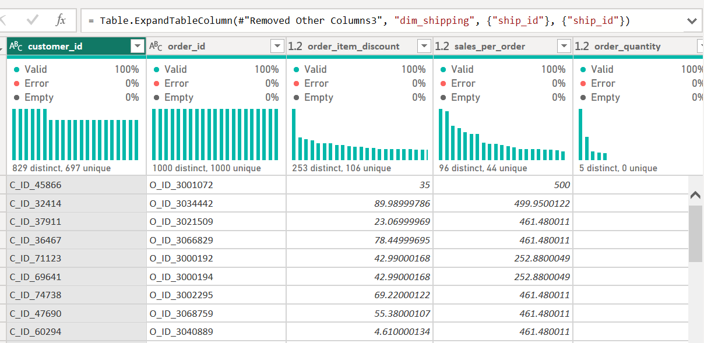    | 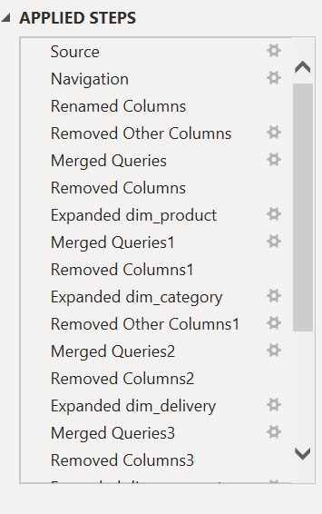

Shipping Table        | Category Table
:--------------------:|:------------------------:
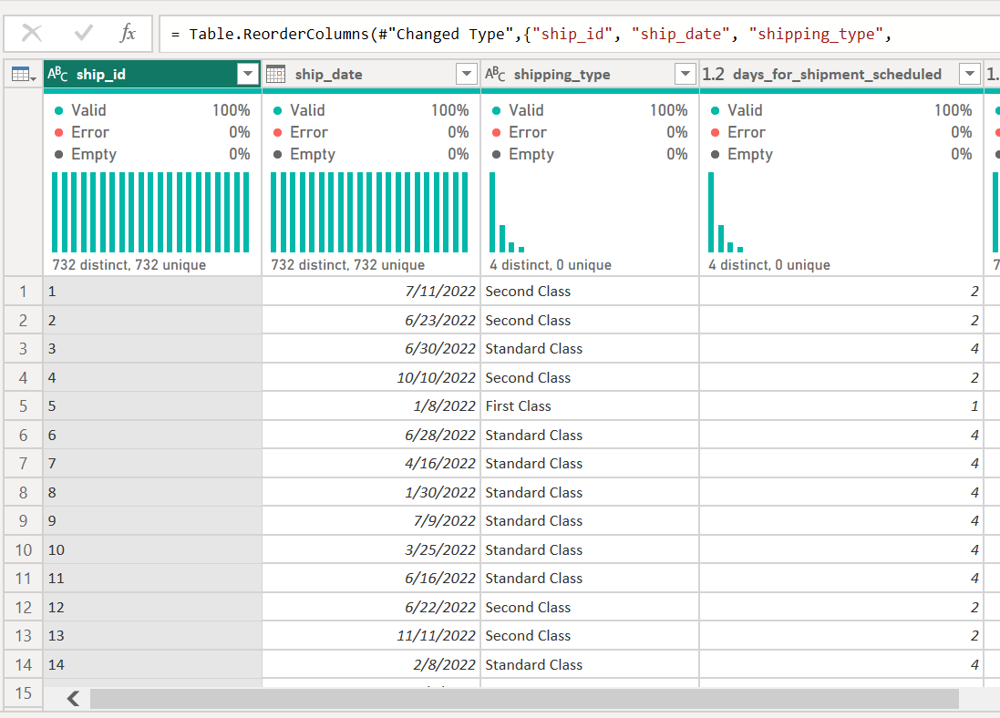 |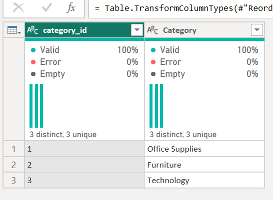

Cusomers Table        |Delivery Table
:--------------------:|:------------------------:
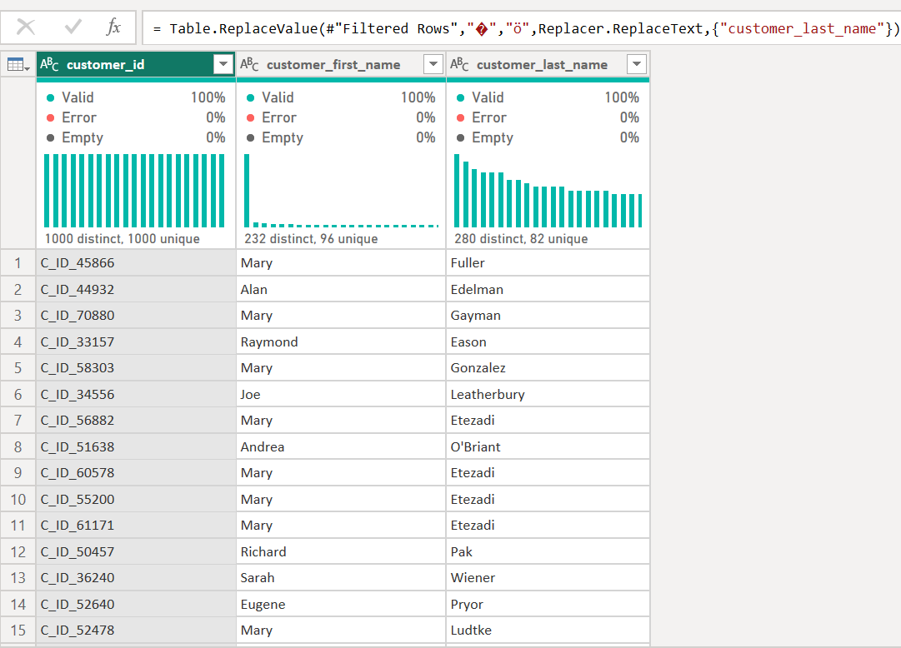 |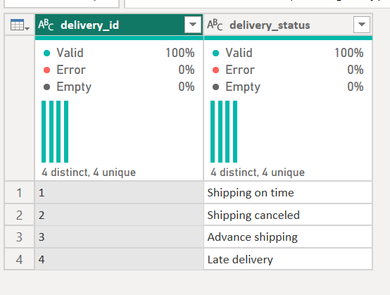

Order Table           |Product Table
:--------------------:|:------------------------:
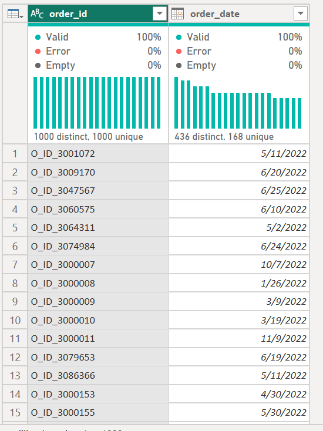    |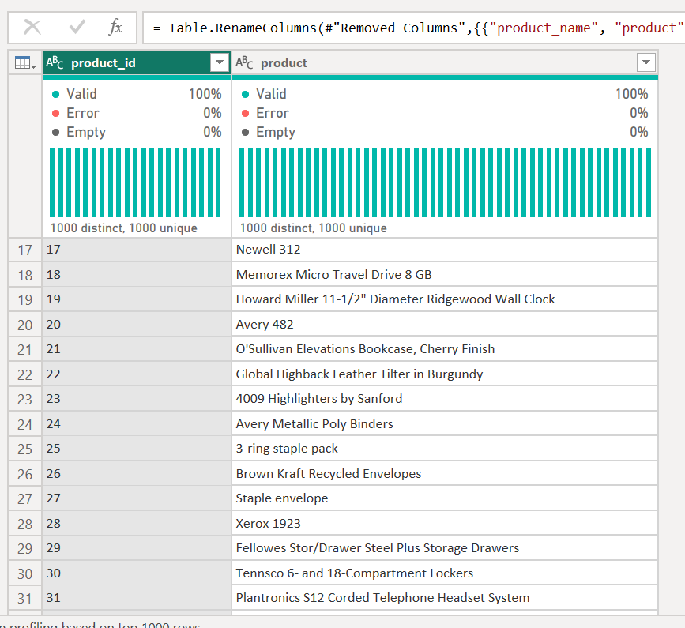

Region Table          |Segment Table
:--------------------:|:------------------------:
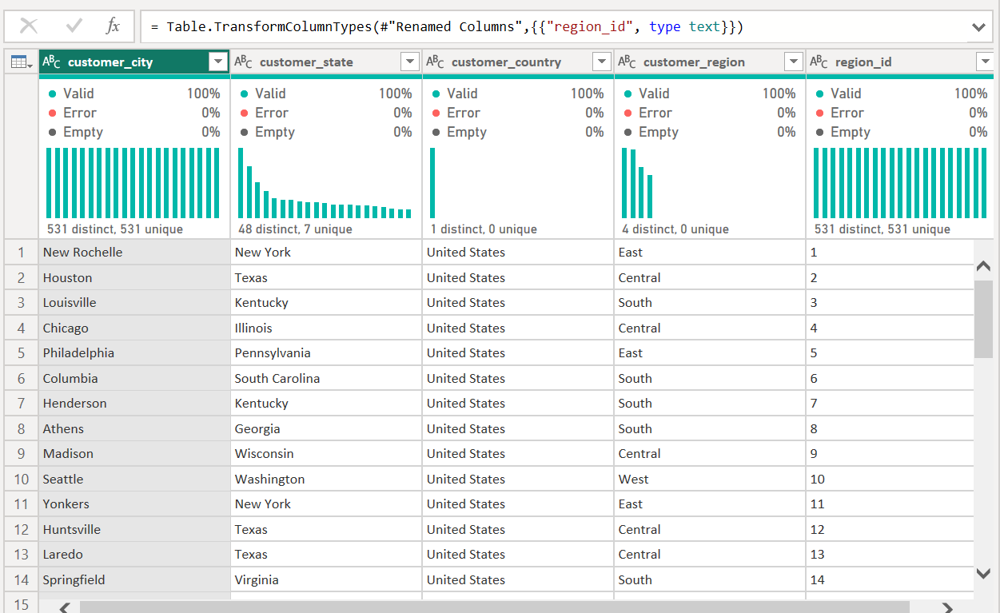   |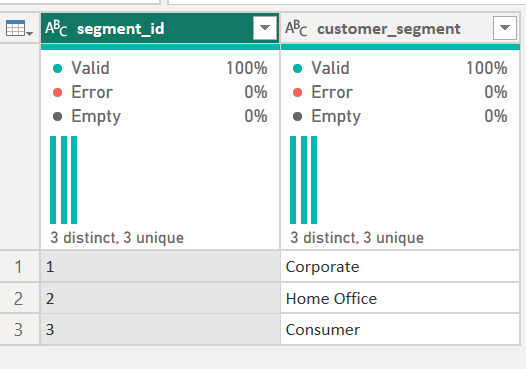

## Data Modelling
Here we create relationships in our tables
I created a Calendar Table, see the code below;

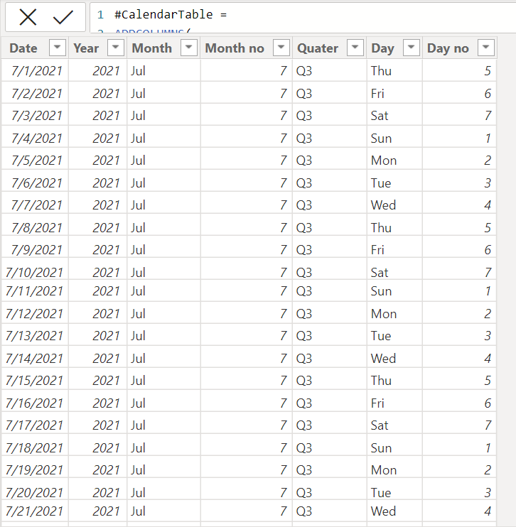

   #CalendarTable = 
   ADDCOLUMNS(
       CALENDAR(MIN('dim_order'[order_date]), MAX('dim_order'[order_date])),
       "Year", YEAR([Date]),
       "Month", FORMAT([Date],"mmm"),
       "Month no", MONTH([Date]),
       "Quater", FORMAT([Date], "\QQ"),
       "Day", FORMAT([Date],"ddd"),
       "Day no", WEEKDAY([Date])

   )
   
 ---
 ***A calculated column for customers_name was created to hold first and lastname in a single column using the code below.**
 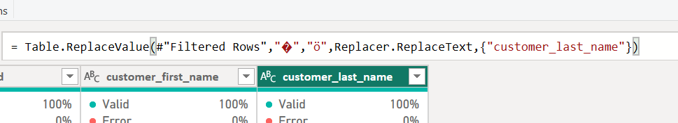 
 
 Customer_name = CONCATENATE('dim_customer'[customer_first_name]," " &  'dim_customer'[customer_last_name])

  Before Modelling          | After Modelling
:--------------------------:|:------------------------:
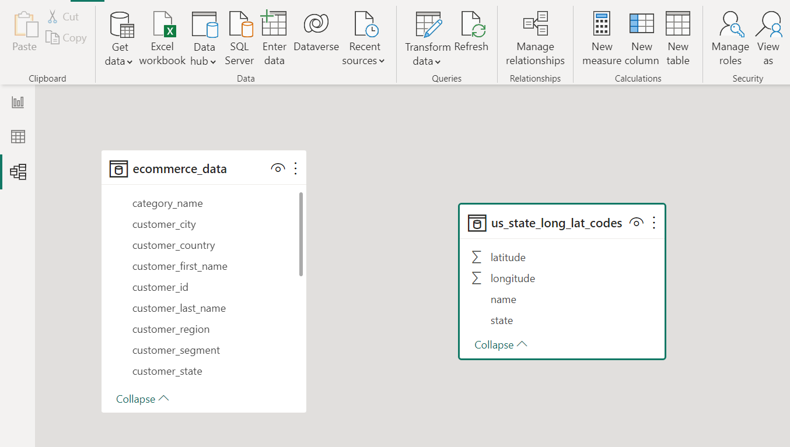   |   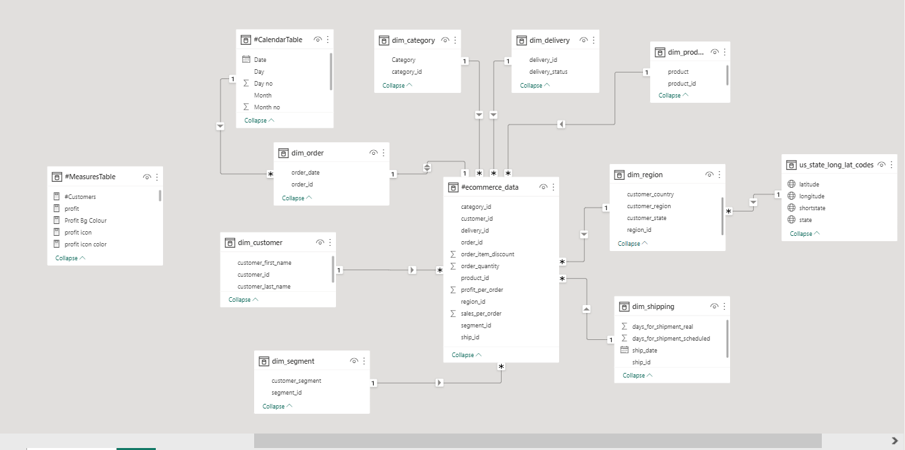

**Hope you can see the beauty of modelling your data**😉

## Data Visualization 📊
Here, I utilized a variety of effective visualizations, including maps, KPI cards, line charts, column charts, tables, and bar charts, to present my analysis and findings. By employing these appropriate visuals, I aimed to facilitate understanding of complex information and enable decision-makers to derive valuable insights from the data. To present the comprehensive analysis, I created a three-page report, which included these visualizations. Please refer to the attached images below to visualize the report.

 1. Sales Page
   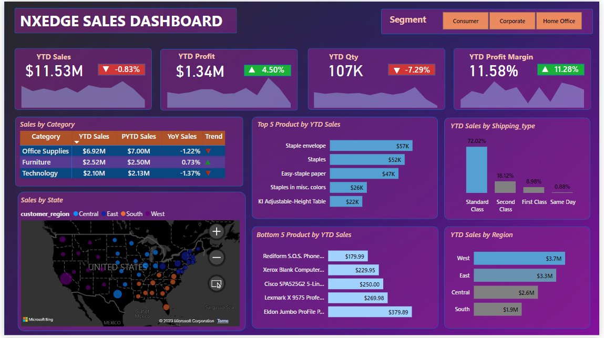
 2. Customers Page 
   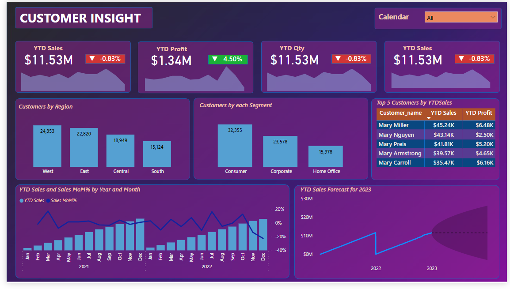
 3. Insights/Recommendation
   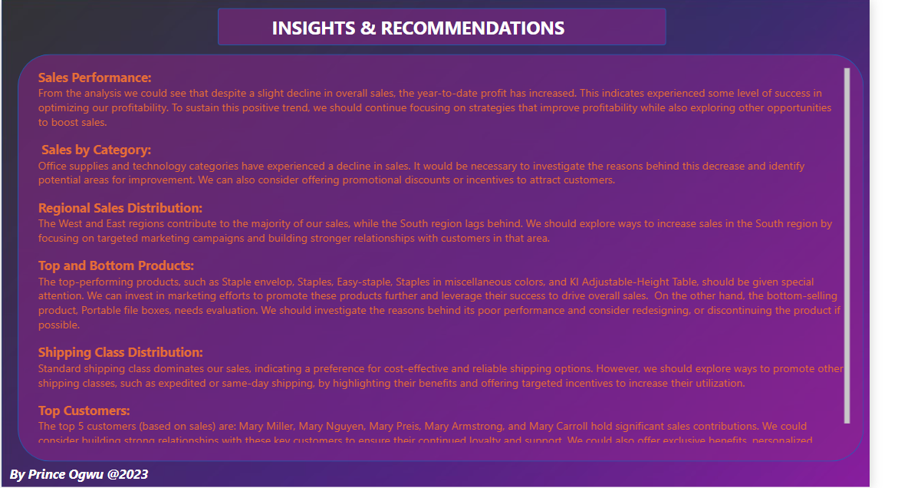
   
**click[here](https://tinyurl.com/5n94sckr)to interact with my report on powerBi Service.

## References
This project was inspired by [Swapnjeet](https://www.linkedin.com/in/swapnjeet-s-58a673273)
